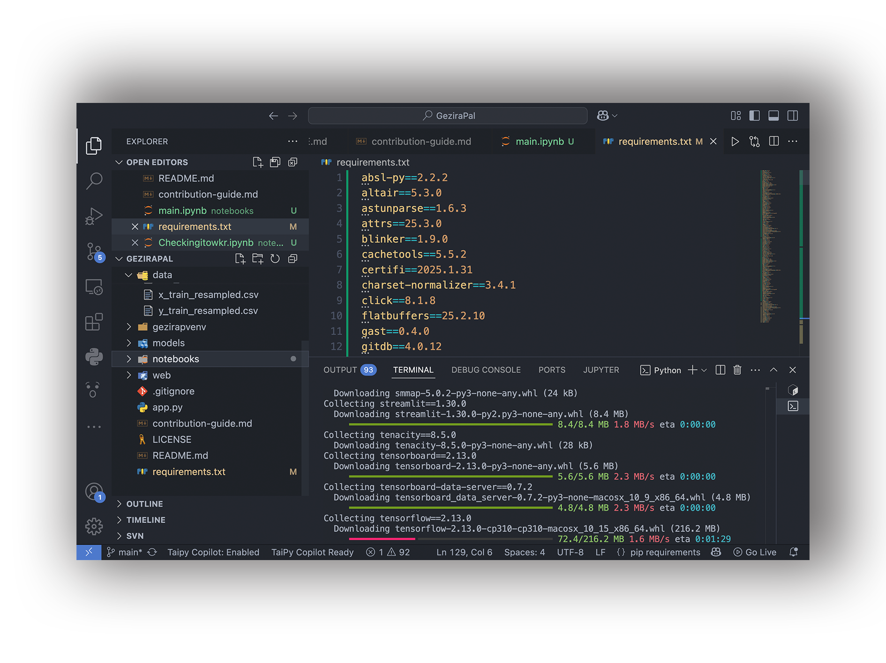

  


# TesnorFlow Fertilizer and Crop Recommendation system 
GeziraPal is a project that aims at assisting individuals with knowledge sharing in agriculture & crop cultivation. The project utilizes TensorFlow, a popular machine learning framework, to develop a recommendation systems for suggesting suitable crops to cultivate based on various factors (atomeshperic parameters and soil readings). so far deployed in Streamlit. 
 watching this demo [video](https://www.youtube.com/watch?v=j5zQ6_LuIZo&t=5s&pp=ygUJZ2V6aXJhcGFs) for more information.


## How to Use the Code

#### Loading and Installing Dependencies

Before running the application, ensure you have installed the necessary dependencies. You can find all the required dependencies along with their corresponding versions in the `requirements.txt` file. we recommend using github virtual enviroment 
using the command `pip install -r requirements.txt` you can install all the software dependcies at once


```bash 
import numpy as np
import pandas as pd
import joblib
import pickle
from sklearn import *
import tensorflow as tf
import tensorflow.keras as keras
import streamlit as st
```

### To use GeziraPal locally, follow these steps:

1/ Clone the repository to your local machine using the following command:

`git clone https://github.com/A7med7x7/GeziraPal.git`

2/ Install the necessary dependencies listed in the requirements.txt file using:

`pip install -r requirements.txt
`



3/ Run the Streamlit web application by executing:

`streamlit run app.py
`
through bash/zsh CLI

4/ you're ready to go! 

### Usage Details
NumPy & Pandas: Use these libraries for numerical computations and data manipulation within your code.
Joblib: Use it as an alternative for loading models, encoders, and scalers saved during preprocessing and model training.
Scikit learn: is used for machine learning algorithms but mainly used for scoring the models from metrics class.
TensorFlow: for machine learning model development / NN architecture.
Streamlit: Utilized for streamlining the web application development process.


## About the Data

#### Source
The dataset was originally obtained from Kaggle: [Crop and Fertilizer Dataset for Western Maharashtra](https://www.kaggle.com/datasets/sanchitagholap/crop-and-fertilizer-dataset-for-westernmaharashtra).
under the name 'Crop and fertilizer dataset.csv' in the data directory

#### Overview
- The dataset is generated and contains 11 features with more than 4k instances.
- After analysis and data generation, it now has over 12k instances.
- The target variable is the crop type.
- In this repository, you will have access to the cleaned version of the dataset.
  1. `Crop and fertilizer dataset.csv`: the raw dataset
  2. `crop_and_fertilizer.csv`: The full dataset.
  3. `x_train_resampled.csv`: The training variables.
  4. `y_train_resampled.csv`: Target variable.


### Notebook Contents

The notebook consists of:

1. Data reading and cleaning.
2. Data preprocessing.
3. Modeling.
4. Evaluation and systemizing functions.

### String Value Input Function

In order to enable users to input string values instead of labeled numbers to represent their information, a function is built using transformers (scaler and encoder).

### Prediction Functions in the App

The app contains 3 prediction functions:

1. **Basic Recommendation Function**:
   - It's a filtering method that uses only Pandas as a tool without any prediction capabilities or modeling.
   - It returns the available crops to grow from the database that match your inputs.

2. **Advanced Recommendation Function**:
   - Using TensorFlow, we build a multi-class classification Keras model that is able to recommend the best crop.

3. **Corresponding YouTube Tutorial Function**:
   - This function returns the predicted label, converts it, and then searches in the corresponding YouTube tutorial from the 'link' column to suggest what to watch.